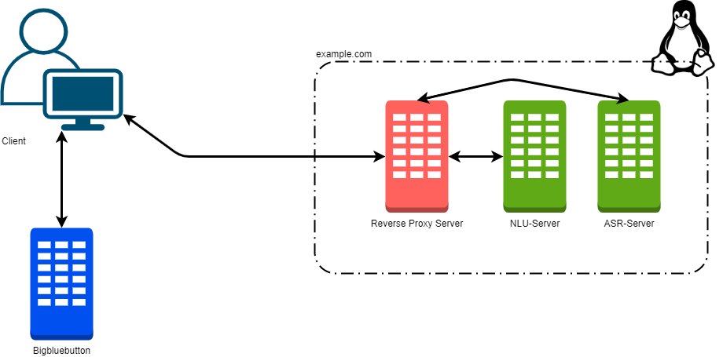
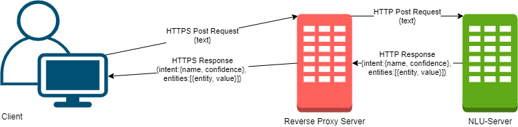
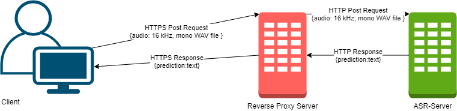
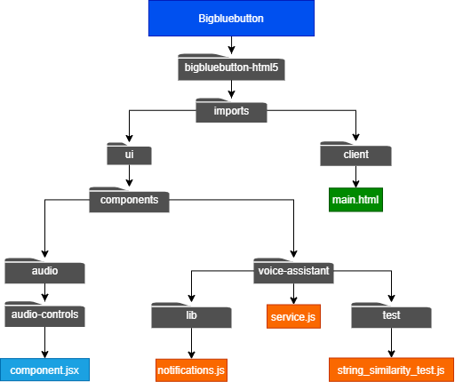

## About this project
This project is about integrating an extension in the [bigbluebutton](https://github.com/bigbluebutton) (open source web conferencing) application which makes it possible to either chat or speak with a personal assistent by communicating with a [Natural Language Understanding API](https://github.com/nvbogu/Natural-Language-Understanding-API) in English.


[](https://www.youtube.com/watch?v=SxJrHGBdCqU&feature=youtu.be&ab_channel=Niklasv.B)


## Table of contents

* [Installation](#installation)
  * [Prerequisites](#prerequisites)
  * [Natural Language Understanding API](#natural-language-understanding-api)
  * [Automatic Speech Recognition API](#automatic-speech-recognition-api)
  * [Setting up a Hybrid Server](#setting-up-a-hybrid-server)
  * [Optional Meeting Summary Extension](#optional-meeting-summary-extension)
* [Start the Hybrid Server](#start-the-hybrid-server)
* [How to continue this project](#how-to-continue-this-project)
* [String similarity test](#string-similarity-test)
* [License](#license)

## Installation

In this section I will talk about what you neet to do to bring your personal assistent within your bigbluebutton application to live.

## Prerequisites

Before you start you need to have a full biglbuebutton server running. You can installl one by fallowing the official [docs](https://docs.bigbluebutton.org/2.2/install.html). 

You also need to fallow this official [guide](https://docs.bigbluebutton.org/2.2/dev.html) for developers to be able to start the bigbluebutton application within the developer mode. 
By fallowing the guide you need to change the fallowing:

* don't fork their bigbluebutton repository, fork mine
* continue fallowing the guide, just clone this repository into your `~/dev` folder and not the one mentioned in the guide

Now you need to install the string similarity package which is used to be able to identify missspelled names or nicknames as users within a bigbluebutton meeting without actually typing the 100% correct name like Niklas will be identified as Niklas_93 if Niklas is present and online within the meeting.

Navigate to your bigbluebutton-html5 folder by running: 
```sh
cd ~/dev/bigbluebutton/bigbluebutton-html5
```

Install the string similarity package by running: 
```sh
npm install string-similarity --save
```

It is also nessesary to roll back some code changes which I have used for my development process: [commit](https://github.com/nvbogu/Personal-Voice-and-Chat-Assistant-within-bigbluebutton/commit/37941d1cf4f10301790b12491854cea3676d84ad). Basicly you just need to remove the `_niklas` everywhere necessary, which locations are mentioned all in the commit above.

## Natural Language Understanding API

In order to identify the intent of the user and his mentioned entities like *"hey bigbluebutton mute Steffen"* which would result in a `wake_up+mute` intent and the entity Steffen you need to install this [Natural Language Understanding API](https://github.com/nvbogu/Natural-Language-Understanding-API).

## Automatic Speech Recognition API

To be able to transcript your commands via voice into text you need to set up a server which runs the [MAX-Speech-to-Text-Converter](https://github.com/IBM/MAX-Speech-to-Text-Converter) as an automatic speech recognition (ASR) API.

## Setting up a Hybrid Server

In this section you will add the ASR-API to your already existing NLU-API in a matter of minutes.

First make sure you have Docker installed. If not please fallow this official guide: [Docker Installation on Ubuntu](https://docs.docker.com/engine/install/ubuntu/).

After that create a folder (e.g. "asr"):

```sh
mkdir asr
```

Navigate to the folder:

```sh
cd asr
```

Clone the used [MAX-Speech-to-Text-Converter](https://github.com/IBM/MAX-Speech-to-Text-Converter):

```sh
git clone https://github.com/IBM/MAX-Speech-to-Text-Converter.git
```

Navigate to the folder:

```sh
cd MAX-Speech-to-Text-Converter 
```

`Hint`: You will need to have sudo rights

Build the docker image

```sh
docker build -t max-speech-to-text-converter . 
```

Start the server

```sh
docker run -it -p 5000:5000 max-speech-to-text-converter
```

Now the only thing you have to do to be able to access our NLU-API and our ASR-API within one server accessable threw your NGNIX webserver is to change your `reverse-proxy.conf` file. Here just need to add another `location` and change a bit the first one from your [Natural Language Understanding API](https://github.com/nvbogu/Natural-Language-Understanding-API).

You can do this by navigate to the site-variables folder by running:

```sh
cd /etc/nginx/sites-available
```

Edit the reverse-proxy.conf file by running:

```sh
vim reverse-proxy.conf
```

Edit the reverse-proxy.conf file by running:

```sh
vim reverse-proxy.conf
```

Change your one location variable to two location variables now and add a path to it like 'location /nlu/' and 'location /asr/. 

```sh
    location /nlu/ {
             proxy_pass http://localhost:4000/;
    }
    location /asr/ {
             proxy_pass http://localhost:5000/;
    }
```

After that is done the NLU-API should be accessable threw:

* `www.example.de/nlu/model/parse` 

and the ASR-API threw' 

* `www.example.de/asr/model/predict`

## Optional Meeting Summary Extension

You can also add the functionality to get a summary of the ongoing meeting if you install this guide here: [Summary Feature Server](https://github.com/vksoniya/SummaryFeatureFlaskServer).

## Start the Hybrid Server

In this section you will start the NGNIX webserver and 2 localhosts. One is the NLU-API and the other is the ASR-API. The NGNIX server will point your post requests to the right API (localhost).

Remeber you can start the NLU server by navigating to your project folder

```sh
cd <your_project_name>
```

Activate your venv by running:

```sh
source ./<your_virtual_environment_name>/bin/activate
```

Now navigate to your repository folder by running:

```sh
cd Natural-Language-Understanding-API
```

With this setup you need to change the localhost of the NLU-API from 5000 to 4000. You can just start it at port 4000 by running:

```sh
rasa run --enable-api -m models/bigbluebutton.tar.gz -p 4000
```

You can start the ASR-API by running:

```sh
docker run -it -p 5000:5000 max-speech-to-text-converter
```

You can do this from anywhere on your Ubuntu machine as sudo user. You can switch to sudo user by running:

```sh
sudo -i
```

Now your personal voice assistent within the bigbluebutton application should be ready to be used! 

## How to continue this project

To get a better understanding of the project I have created the fallowing images to illustrate different functionalies and where they are located.

The current architecture looks like this:


The communication between the client and the NLU-Server looks like this: 


The communication between the client and the ASR-Server looks like this: 


The files which I have changed are located here: 


Known Bug:

As of right now this extension is not running in the Firefox Browser duo to the Recorder class. This sould be fixed for a production environment.

## String similarity test

To be able to mute a person which name is falsely identified by the ASR-Server or by the user entering the name in the chat wrong there is a string (name) similarity method used to even identify those cases. 

E.g. Niklas should be muted but there is only Niklas_93 in the current meeting.

This string-similarity method is provided by the [string-similarity](https://www.npmjs.com/package/string-similarity) package.

A test (file) of this method is located at:

```sh
bigbluebutton-html5/tests/string_similarity_test/string_similarity_test.ipynb
```

It is also possible to take a look at the test with the jupyter nbviewer [here](https://nbviewer.jupyter.org/github/nvbogu/Personal-Voice-and-Chat-Assistant-within-bigbluebutton/blob/develop/bigbluebutton-html5/tests/string_similarity_test/string_similarity_test.ipynb).

## License

This project is open source for everyone. 
